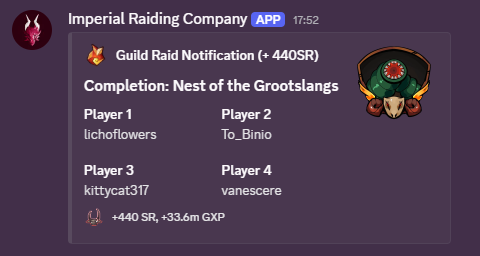

# Wynn Raid Reporter

> Simple Fabric client mod for relaying Wynncraft guild raid completions to discord via [Ktor server](https://github.com/ImpWynn/WynnRaidRelay)
 
If you are a guild member you probably do not need to setup the relay server yourself. 
Simply install the dependencies and enter the URL given by your guild leader in the settings.

### Dependencies
- [Fabric Language Kotlin](https://modrinth.com/mod/fabric-language-kotlin)
- [Fabric API](https://modrinth.com/mod/fabric-api)

### Usage
- `K` (default) - Open settings to enter relay URL
- `/autoupdate raid-reporter` - Fetch latest release automatically

Feel free to suggest changes or improvements!